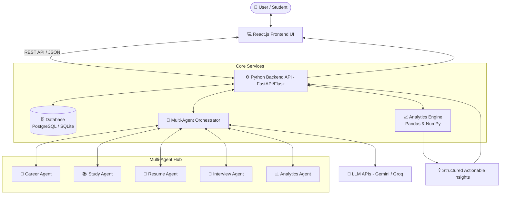

# 🚀 LifeOps AI — Personal Life & Career Intelligence Assistant

<p align="center">
  
  
  
  
  
</p>

> **"Track your life. Understand your data. Improve your future."**

**LifeOps AI** is an intelligent personal management platform engineered specifically for students, fresh graduates, and early-career professionals. It fuses **AI Multi-Agent Systems, Data Analytics, Career Roadmapping, Productivity Tracking, Resume Parsing, and Mock Interview Preparation** into a single unified workspace.

Instead of acting as a generic conversational chatbot, **LifeOps AI** continuously monitors user activity, processes behavioral datasets, and outputs **actionable, data-driven insights and personalized growth roadmaps**.

---

## 📑 Table of Contents

- [🎯 Problem Statement](#-problem-statement)
- [💡 Proposed Solution & Workflow](#-proposed-solution--workflow)
- [🤖 Specialized AI Agents](#-specialized-ai-agents)
  - [1. 🎯 Career Agent](#1--career-agent)
  - [2. 📚 Study Agent](#2--study-agent)
  - [3. 📄 Resume Agent](#3--resume-agent)
  - [4. 🎤 Interview Agent](#4--interview-agent)
  - [5. 📊 Analytics Agent](#5--analytics-agent)
- [📊 Main Dashboard](#-main-dashboard)
- [✨ Key Features](#-key-features)
  - [📚 Productivity & Habit Tracking](#-productivity--habit-tracking)
  - [💼 Job Application Pipeline](#-job-application-pipeline)
  - [🧠 Skill Inventory & Mastery](#-skill-inventory--mastery)
- [📈 Data Analytics Engine](#-data-analytics-engine)
- [🛠️ Technology Stack](#️-technology-stack)
- [🏗️ System Architecture](#️-system-architecture)
- [📁 Suggested Project Structure](#-suggested-project-structure)
- [🔄 End-to-End User Journey](#-end-to-end-user-journey)
- [🔐 Security & Privacy](#-security--privacy)
- [🚀 Future Enhancements](#-future-enhancements)
- [🎓 Skills Demonstrated](#-skills-demonstrated)
- [💼 Why This Project Is Valuable](#-why-this-project-is-valuable)
- [📌 Project Status & Roadmap](#-project-status--roadmap)

---

## 🎯 Problem Statement

Students and aspiring professionals currently juggle a fragmented ecosystem of disconnected tools:

* 📚 **Study planning:** Notion, Todoist, Google Calendar
* 💼 **Job applications:** Excel sheets, LinkedIn, Indeed
* 📄 **Resume preparation:** Canva, Overleaf, Word
* 🧠 **Skill development:** Coursera, LeetCode, GitHub
* 🎤 **Interview preparation:** Mock sessions, glassdoor threads
* 📊 **Productivity tracking:** Clockify, Pomodoro apps
* 💰 **Expense tracking:** Splitwise, personal notes

Because these activities remain siloed in disparate apps, answering critical career questions becomes impossible:

1. **Where are the critical skill gaps?**
2. **Where is study time being wasted vs. yielding test gains?**
3. **Which jobs are realistically aligned with current competencies?**
4. **What high-leverage topic should be mastered next?**
5. **Does the resume accurately match modern ATS criteria for target roles?**
6. **Is interview delivery and confidence quantitatively improving over time?**

**LifeOps AI** converges these domains into a **single intelligent ecosystem**.

---

## 💡 Proposed Solution & Workflow

LifeOps AI collects raw behavioral data across study sessions, application pipelines, and skill check-ins, feeds it to an analytical computing engine, and activates autonomous AI agents to deliver targeted intelligence back to the user.

```text
                 USER DATA
                     │ (Daily activity, scores, resumes, logs)
                     ▼
            ┌─────────────────┐
            │     Database    │
            │ PostgreSQL / DB │
            └────────┬────────┘
                     │
                     ▼
            ┌─────────────────┐
            │ Analytics Engine│
            │ Pandas / NumPy  │
            └────────┬────────┘
                     │ Statistical Patterns
                     ▼
            ┌─────────────────┐
            │    AI Agents    │
            │ Gemini / Groq   │
            └────────┬────────┘
                     │
            ┌────────┼────────┐
            ▼        ▼        ▼
         Insights  Planning  Recommendations
                     │
                     ▼
              USER DASHBOARD
```

---

## 🤖 Specialized AI Agents

Rather than relying on a single, surface-level chatbot, LifeOps AI implements **5 specialized multi-agent roles**:

### 1. 🎯 Career Agent
*Helps users navigate career trajectories, decode requirements, and measure job readiness.*

* **Key Features:**
  * Analyzes current skill set and historical mastery.
  * Compares profile against live or target job postings.
  * Identifies missing hard and soft competencies.
  * Recommends high-priority learning paths.
  * Tracks career milestone completion.

```text
Current Skills:
Python | SQL | Power BI | Java

Target Job Requirement (Data Scientist / ML Engineer):
Python | SQL | Machine Learning | Power BI | AWS

🤖 AI Career Agent Insight:
"You meet 60% of the profile requirements. You are currently missing Machine Learning
and AWS. Prioritize introductory Scikit-Learn pipelines and Cloud Storage basics."
```

---

### 2. 📚 Study Agent
*Analyzes learning behaviors, identifies study bottlenecks, and automates schedule generation.*

* **Key Features:**
  * Tracks focused study duration per subject.
  * Correlates test scores with study methods and hours.
  * Pinpoints weak subjects and sub-topics.
  * Generates adaptive weekly study timetables.
  * Alerts on study decay or abandoned topics.

```text
SQL Practice & Test Scores:
Test 1 → 55%
Test 2 → 61%
Test 3 → 64%
Test 4 → 48% (Logged after 0.5h study)
Test 5 → 72% (Logged after 3.5h study)

🤖 AI Study Agent Insight:
"Your SQL test performance correlates strongly (+0.82) when session length exceeds 3 hours.
Lower performance occurred on Window Functions. Focus on Joins and Subqueries this week."
```

---

### 3. 📄 Resume Agent
*Parses resumes and conducts deep ATS (Applicant Tracking System) keyword and relevance audits.*

* **Key Features:**
  * PDF and DOCX resume text extraction.
  * Job description keyword and skill comparison.
  * ATS scoring and readability suggestions.
  * Action-verb and impact-metric enhancements.
  * Missing technical and industry keyword alerts.

```text
Job Description:
Python, SQL, Power BI, Machine Learning, Excel

Your Resume Extracted:
Python, SQL, Java, Power BI

Missing Skills & Recommendations:
❌ Machine Learning
❌ Excel
💡 Recommendation: Add quantified bullet points highlighting data processing in Python.
```

---

### 4. 🎤 Interview Agent
*Conducts simulated mock interviews with role-specific rubrics and performance evaluations.*

* **Key Features:**
  * Generates technical, situational, and HR questions.
  * Creates custom queries based on candidate's uploaded projects.
  * Multi-dimensional scoring (Technical correctness, Clarity, Delivery).
  * Pinpoints missing technical keywords in spoken/written answers.
  * Historical interview improvement tracking.

```text
Prompt Question:
"Explain your Car Resale Price Prediction project and your choice of algorithms."

User Answer:
[User records audio / submits transcript]

🤖 AI Evaluation:
• Technical Knowledge:   8 / 10
• Communication Clarity: 7 / 10
• Project Understanding: 9 / 10

Actionable Feedback:
- Clarify why XGBoost outperformed baseline Random Forest.
- Mention specific evaluation metrics (RMSE, MAE, R² score).
```

---

### 5. 📊 Analytics Agent
*Transforms raw user records into meaningful behavioral statistics and actionable notifications.*

* **Data Points Analyzed:**
  * Study duration & time distribution
  * Test & quiz scores
  * Job application pipeline volume & conversion rates
  * Mock interview feedback trends
  * Skill progress velocities
  * Daily routines & productivity metrics

```text
📈 SQL score improved by 18% over the last 30 days.
📚 You dedicated 12 hours to Python this week (Top subject).
💼 18 job applications submitted this month (Conversion: 16% to interview).
🎤 Mock interview average score progressed from 62% → 74%.
⚠️ DSA (Data Structures & Algorithms) practice dropped by 35% — 5 days idle.
```

---

## 📊 Main Dashboard

The dashboard acts as mission control, synthesizing real-time activity and AI agent directives into an intuitive visual layout:

```text
┌────────────────────────────────────────────────────────────────────────┐
│                               LIFEOPS AI                               │
├─────────────────────┬──────────────────────────┬───────────────────────┤
│    📚 Study Time    │      💼 Job Pipeline     │    🧠 Skill Mastery   │
│    42 hrs (Month)   │   18 Applied • 3 Interv. │    72% Overall Avg    │
├─────────────────────┴──────────────────────────┴───────────────────────┤
│                                                                        │
│                      📈 Skill Progress Overview                        │
│                                                                        │
│  Python     ████████████████████████████░░░░░░  80% (Advanced)         │
│  SQL        ████████████████████░░░░░░░░░░░░░░  65% (Intermediate)     │
│  Power BI   ███████████████░░░░░░░░░░░░░░░░░░░  50% (Intermediate)     │
│  DSA        ████████████░░░░░░░░░░░░░░░░░░░░░░  40% (Needs Focus)      │
│                                                                        │
├────────────────────────────────────────────────────────────────────────┤
│                          🤖 AGENT INSIGHTS HUB                         │
│                                                                        │
│  • 📈 SQL test scores improved +18% following multi-hour deep work     │
│  • ⚠️ DSA has not been practiced in 5 days; streak at risk             │
│  • 💼 4 submitted applications require follow-up emails this week      │
│  • 📄 Target profile 'Data Scientist' requires 2 missing core skills    │
└────────────────────────────────────────────────────────────────────────┘
```

---

## ✨ Key Features

### 📚 Productivity & Habit Tracking
* Log study sessions with subject tags and focus ratings.
* Monitor LeetCode/coding practice runs and project commit sessions.
* Course and certificate completion trackers.
* Integrated Pomodoro timer and daily task management.

---

### 💼 Job Application Pipeline
Track applications with kanban-style agility:

$$\text{Company} \longrightarrow \text{Role} \longrightarrow \text{Applied} \longrightarrow \text{Shortlisted} \longrightarrow \text{Interview} \longrightarrow \text{Offer / Result}$$

| Status | Definition | Next Best Action |
| :--- | :--- | :--- |
| **Applied** | Application submitted online | Wait 5 business days |
| **Shortlisted** | Screening passed / HR contacted | Prepare company research |
| **Interview Scheduled**| Technical or behavioral rounds set | Run Interview Agent drills |
| **Selected / Offer** | Offer received | Compare compensation & scope |
| **Rejected** | Application closed | Log feedback for Analytics Agent |
| **Follow-up Required** | No response after threshold | Dispatch follow-up email template |

---

### 🧠 Skill Inventory & Mastery

Users manage dynamic skills tied to tangible verification (hours logged, projects built, test scores):

| Skill | Category | Level | Verified Progress | Status |
| :--- | :--- | :--- | :---: | :--- |
| **Python** | Programming | Advanced | **80%** | 🟢 Active |
| **SQL** | Databases | Intermediate | **65%** | 🟢 Active |
| **Power BI** | Business Intelligence | Intermediate | **50%** | 🟡 Consistent |
| **Java** | Programming | Intermediate | **70%** | 🟢 Stable |
| **Machine Learning**| Data Science | Beginner | **35%** | 🔴 Needs Attention |

---

## 📈 Data Analytics Engine

LifeOps AI utilizes statistical techniques (regression, correlation matrices, moving averages) to unearth patterns across user habits:

* **Study Hours vs. Test Scores:** Identifies the minimum effective dose of study time needed for mastery.
* **Skill Progress over Time:** Forecasts readiness dates for specific career roles.
* **Application Conversion Funnel:** Uncovers if rejections occur at the resume screen or interview stage.
* **Consistency Heatmaps:** Visualizes active days versus burn-out periods.

```text
Study Duration (Hours)    Observed Test Score (%)
         1.0                       45%
         2.0                       55%
         3.0                       67%
         4.0                       74%
         5.0                       78%

Regression Insight:
Strong positive correlation between hours and retention; diminishing returns begin past 4.5h.
```

---

## 🛠️ Technology Stack

| Layer | Technologies |
| :--- | :--- |
| **Frontend** | React.js, Vite, HTML5, CSS3, JavaScript / TypeScript, Tailwind CSS, Lucide Icons |
| **Data Visualization** | Chart.js, Recharts |
| **Backend API** | Python 3.10+, FastAPI / Flask, Pydantic, RESTful API |
| **Database & ORM** | PostgreSQL / SQLite, SQLAlchemy |
| **Data Analytics** | Pandas, NumPy, Scikit-learn, SciPy |
| **AI & LLM Services** | Google Gemini API, Groq, LangChain / LlamaIndex, RAG (Retrieval-Augmented Generation) |
| **Document Processing**| PyPDF2 / pypdf, python-docx |
| **DevOps & Tooling** | Git, GitHub, Docker, Postman, VS Code |
| **Cloud & Deployment** | Render, Railway, Vercel |

---

## 🏗️ System Architecture



---

## 📁 Suggested Project Structure

```text
lifeops-ai/
│
├── frontend/                     # React Single Page Application
│   ├── public/                   # Static assets & icons
│   ├── src/
│   │   ├── assets/               # Branding, images, SVGs
│   │   ├── components/           # Reusable UI cards, navbars, modals
│   │   ├── pages/                # Dashboard, Study, Career, Resume, Interview
│   │   ├── services/             # API client & axios endpoints
│   │   ├── charts/               # Recharts & Chart.js visual wrappers
│   │   ├── App.jsx               # Application root & router
│   │   └── index.css             # Design tokens & styling
│   ├── package.json
│   └── vite.config.js
│
├── backend/                      # Python Server & Intelligence Services
│   ├── app.py                    # Application bootstrap & route registration
│   ├── config.py                 # Environment configurations & credentials
│   │
│   ├── agents/                   # Autonomous AI agent modules
│   │   ├── career_agent.py       # Skill gap & career trajectory analyzer
│   │   ├── study_agent.py        # Schedule generation & study efficiency
│   │   ├── resume_agent.py       # ATS parsing & keyword matching
│   │   ├── interview_agent.py    # Mock interviewer & answer evaluator
│   │   └── analytics_agent.py    # Trend detection & weekly reporting
│   │
│   ├── analytics/                # Statistical computation engine
│   │   ├── analysis.py           # Pandas data cleaning & correlation models
│   │   └── insights.py           # Insight generator rules & heuristics
│   │
│   ├── models/                   # Database schemas
│   │   └── database_models.py    # SQLAlchemy tables (Users, Skills, Jobs, Tests)
│   │
│   ├── routes/                   # REST API controllers
│   │   ├── auth.py               # Authentication & user profile
│   │   ├── career.py             # Career progress endpoints
│   │   ├── study.py              # Study logs & test recording
│   │   ├── resume.py             # Resume upload & parsing
│   │   └── interview.py          # Mock session interactions
│   │
│   └── requirements.txt          # Python dependencies
│
├── data/                         # Mock data & sample testing records
│   └── sample_data.csv
│
├── docs/                         # Extended specifications & architecture guides
│   └── project_documentation.md
│
├── .env.example                  # Environment variable template
├── .gitignore                    # Ignored files (venv, node_modules, .env)
└── README.md                     # Main project documentation
```

---

## 🔄 End-to-End User Journey

```text
1. Onboarding
   User defines profile, degree, career target (e.g., "Data Analyst"), and baseline skills.
        │
        ▼
2. Daily Tracking
   User logs 2h Python study, 1.5h SQL query practice, and uploads latest quiz score.
        │
        ▼
3. Job Application Logging
   User applies to "ABC Technologies" for Junior Analyst role and stores job link.
        │
        ▼
4. Resume Health Check
   Resume is parsed against target job description. AI identifies missing skills (e.g., Tableau, AWS).
        │
        ▼
5. Autonomous Agent Synthesis
   Study Agent notices SQL retention is high, while Career Agent alerts on missing AWS knowledge.
        │
        ▼
6. Tailored Action Plan
   System delivers dynamic 5-day action plan:
   • Days 1–2: Master introductory AWS S3 / Cloud querying
   • Days 3–4: Build miniature Tableau dashboard
   • Day 5: Mock technical interview drill with Interview Agent
```

---

## 🔐 Security & Privacy

* **Zero Hardcoded Secrets:** All API keys (`GEMINI_API_KEY`, `DATABASE_URL`, `JWT_SECRET`) managed via `.env` and excluded via `.gitignore`.
* **Password Hashing:** Passwords encrypted using `bcrypt` / `argon2`.
* **JWT Authentication:** Stateless, signed JSON Web Tokens for session management.
* **Input Sanitization & Validation:** Comprehensive Pydantic models preventing SQL injection and payload corruption.
* **Data Privacy:** Personal resumes and notes processed securely without third-party persistent retention.

---

## 🚀 Future Enhancements

* 🎙️ **AI Voice Conversational Mode:** Real-time speech-to-speech mock interviews using WebRTC & speech synthesis.
* 🤖 **Autonomous Job Crawler & Auto-Match:** Scrapes curated job boards and ranks matching roles based on verified skill score.
* 📬 **Email Inbox Intelligence:** Connects to Gmail/Outlook API to parse job application status changes automatically.
* 🗓️ **Calendar Auto-Scheduling:** Syncs study blocks and interview dates directly into Google Calendar.
* 🔮 **Predictive Career Forecasting:** Machine learning regression predicting "Weeks until job-ready" based on study velocity.

---

## 🎓 Skills Demonstrated

* **Full-Stack Web Development:** Component architecture in React, responsive design, RESTful API design.
* **Multi-Agent AI Engineering:** Prompt engineering, structured agent orchestration, RAG pipelines.
* **Data Science & Analytics:** Feature engineering, exploratory data analysis (EDA), trend forecasting with Pandas & NumPy.
* **Document Processing:** Unstructured text extraction from PDFs/DOCX and NLP keyword evaluation.
* **Software Architecture:** Modular folder design, database normalization, secure credential management.

---

## 💼 Why This Project Is Valuable

LifeOps AI goes far beyond a generic boilerplate project. It combines:

$$\text{Full-Stack Engineering} + \text{Data Analytics} + \text{Generative AI Agents} + \text{Machine Learning}$$

This positions it as an exceptional **capstone project, production-grade portfolio showcase, and talking point in software & data engineering interviews**.

---

## 📌 Project Status & Roadmap

```text
🚧 Status: Under Active Development
```

- [x] Repository initialization & architecture design
- [ ] Database schema definition & migration setup
- [ ] User authentication (JWT + Bcrypt)
- [ ] Interactive React Dashboard UI
- [ ] Study & Productivity Tracking module
- [ ] Job Application Kanban Pipeline
- [ ] Skill Tracking & Mastery calculation
- [ ] Resume Agent (PDF extraction + ATS matching)
- [ ] Career Agent (Gap analysis & roadmap generation)
- [ ] Interview Agent (Interactive technical mock simulator)
- [ ] Analytics Agent (Correlation engine & insight dispatch)
- [ ] Comprehensive unit & integration testing
- [ ] Cloud deployment (Vercel + Render + PostgreSQL)

---

## 🤝 Contributing

Contributions, issues, and feature requests are welcome!  
Feel free to check the [issues page](https://github.com/Aditimore05/LifeOps_AI/issues).

1. Fork the Project
2. Create your Feature Branch (`git checkout -b feature/AmazingFeature`)
3. Commit your Changes (`git commit -m 'Add some AmazingFeature'`)
4. Push to the Branch (`git push origin feature/AmazingFeature`)
5. Open a Pull Request

---

## 📄 License

Distributed under the MIT License. See `LICENSE` for more information.

---

<p align="center">
  Built with ❤️ for learners and professionals aiming for excellence.
</p>
