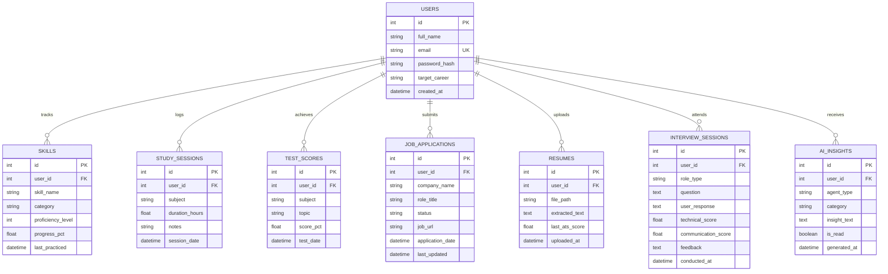

# LifeOps AI — Detailed Project Documentation & System Design

## 1. Executive Summary

LifeOps AI is an AI-orchestrated productivity, career readiness, and learning management platform designed for students and entry-level professionals. It unifies scattered data points—study habits, job applications, interview practice, resume audits, and skill tracking—into a centralized data lake powered by predictive analytics and autonomous multi-agent intelligence.

---

## 2. Multi-Agent System Architecture

The core of LifeOps AI is composed of five specialized autonomous agents:

```text
+--------------------------------------------------------------------------+
|                            Multi-Agent Hub                               |
|                                                                          |
|   +--------------------+  +--------------------+  +------------------+   |
|   |    Career Agent    |  |    Study Agent     |  |   Resume Agent   |   |
|   |                    |  |                    |  |                  |   |
|   | • Skill gap radar  |  | • Schedule engine  |  | • PDF/DOCX parse |   |
|   | • Role comparison  |  | • Test correlation |  | • ATS scoring    |   |
|   +--------------------+  +--------------------+  +------------------+   |
|               |                     |                     |              |
|               +---------------------+---------------------+              |
|                                     |                                    |
|                   +-----------------+-----------------+                  |
|                   |                                   |                  |
|          +--------------------+              +--------------------+      |
|          |  Interview Agent   |              |  Analytics Agent   |      |
|          |                    |              |                    |      |
|          | • Mock simulator   |              | • Behavior models  |      |
|          | • Answer scoring   |              | • Anomaly alerts   |      |
|          +--------------------+              +--------------------+      |
+--------------------------------------------------------------------------+
```

### 2.1 Agent Specifications

| Agent | Core Input Data | Primary Output | Recommended LLM / Tooling |
| :--- | :--- | :--- | :--- |
| **Career Agent** | User skills, target role, job posting text | Skill gap matrix, prioritized curriculum | Gemini 1.5 Flash / Groq LLaMA-3 |
| **Study Agent** | Subject logs, session timestamps, quiz scores | Adaptive weekly timetable, retention alerts | Rule engine + LLM scheduling |
| **Resume Agent** | Resume PDF/Word, Target Job Description | ATS match rate (0-100%), missing keywords | pypdf / python-docx + LLM RAG |
| **Interview Agent**| Project description, interview round type, user answer | Multi-rubric scoring (1-10), model answer diff | Whisper (Voice) + Gemini / Groq |
| **Analytics Agent**| Historical logs across all modules | Weekly report, trend insights, streak notices | Pandas, NumPy, Scikit-learn |

---

## 3. Database Schema Design (Relational Entities)

### 3.1 Entity Relationship Overview



---

## 4. API Specification & Endpoints

### 4.1 Authentication & Profile
- `POST /api/auth/register`: Create user account and baseline goal.
- `POST /api/auth/login`: Authenticate and issue JWT.
- `GET /api/auth/me`: Fetch authenticated user profile.

### 4.2 Study & Productivity
- `GET /api/study/sessions`: Retrieve historical study logs.
- `POST /api/study/sessions`: Create study duration record.
- `POST /api/study/tests`: Submit quiz/test results.
- `GET /api/study/analytics`: Retrieve study vs. performance correlation data.

### 4.3 Skills Tracking
- `GET /api/skills`: List all tracked skills with completion status.
- `POST /api/skills`: Add a new skill to track.
- `PUT /api/skills/{id}`: Update skill progress percentage.

### 4.4 Job Application Pipeline
- `GET /api/jobs`: List applications with status filter.
- `POST /api/jobs`: Log new job application.
- `PATCH /api/jobs/{id}/status`: Transition stage (e.g. Applied -> Interview Scheduled).

### 4.5 AI Agents & Insights
- `POST /api/agents/resume/analyze`: Parse resume file against job description.
- `POST /api/agents/career/gap-analysis`: Generate gap analysis and curriculum.
- `POST /api/agents/interview/generate-question`: Produce technical question from project.
- `POST /api/agents/interview/evaluate`: Submit answer for scoring and critique.
- `GET /api/agents/insights`: Fetch prioritized feed of AI insights.

---

## 5. Analytics & Heuristics Logic

### Study-to-Score Correlation Formula
$$\rho_{X,Y} = \frac{\operatorname{cov}(X,Y)}{\sigma_X \sigma_Y}$$
Where:
- $X$ is hours spent studying a topic.
- $Y$ is the test score percentage.

When $\rho > 0.6$, the system identifies positive compounding. If hours are high but scores plateau, the **Study Agent** triggers a pedagogical intervention suggesting alternative formats (e.g., flashcards, projects instead of passive reading).

---

## 6. Implementation Milestones

1. **Sprint 1 — Core Infrastructure**: FastAPI application setup, PostgreSQL schemas, JWT auth, React Vite shell.
2. **Sprint 2 — Activity Trackers**: Study logger, Job application kanban, Skill inventory.
3. **Sprint 3 — AI Agent Integration**: Resume parser with LLM evaluation, Interview Simulator with prompt engineering.
4. **Sprint 4 — Analytics & Dashboards**: Pandas correlation engine, Recharts dashboard visualizations, weekly summary dispatch.
5. **Sprint 5 — Polish & Deployment**: Docker containerization, cloud deployment, and end-to-end testing.
